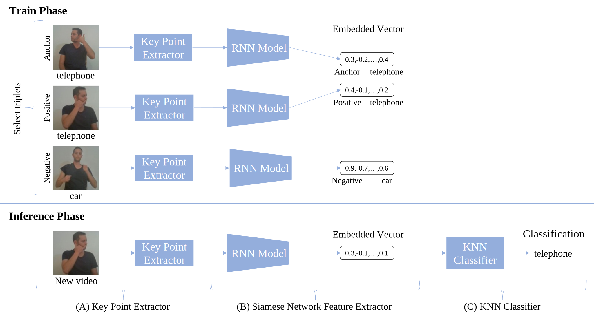

# Few-Shot Sign Language Recognition using Contrastive Learning

This repository provides a clean, reproducible pipeline for:

- Training embedding models on the **MESL** dataset using triplet loss.
- Evaluating **local pretrained MESL models** on **FESL** using few-shot support/query splits and KNN.



## Requirements

- Python `3.11.x` (required)
- TensorFlow `2.14.1`
- Keras `2.14.0`
- TensorFlow Addons `0.22.0`

The project is tested with this version set. Using newer TensorFlow/Keras versions may cause compatibility errors (for example: `No module named keras.src.engine`).
## Quick Start

```powershell
py -3.11 -m venv .venv
.\.venv\Scripts\Activate.ps1
pip install -r requirements.txt
python scripts/download_datasets.py
python scripts/eval_fesl_sweep_all.py --config configs/fesl_eval.yaml
```

## What This Repo Includes

- Config-driven experiments (YAML).
- Standalone scripts for training and evaluation.
- Dataset bootstrap script from Google Drive links.
- CSV + figure outputs (PNG + SVG) for FESL sweep experiments.

## Repository Structure

```text
slr_26/
  configs/
    mesl_train.yaml
    fesl_eval.yaml
  scripts/
    download_datasets.py
    train_mesl.py
    eval_fesl_pretrained.py
    eval_fesl_sweep_all.py
  src/slr/
    __init__.py
    configs.py
    data.py
    metrics.py
    models.py
    plotting.py
  requirements.txt
```

## Environment Setup

1. Create and activate a Python environment (recommended Python 3.11):

```powershell
py -3.11 -m venv .venv
.\.venv\Scripts\Activate.ps1
```

2. Install dependencies:

```powershell
pip install -r requirements.txt
```

## Dataset Setup

The project uses two datasets hosted on Google Drive:

- MESL: `https://drive.google.com/file/d/1DavK1m4cVOOkSqXcRm1ZJw6JEWeGSPZf/view?usp=sharing`
- FESL: `https://drive.google.com/file/d/1zxg3Yafon_v94gGI_zPXYKbK6l_6cjZH/view?usp=sharing`

Use the provided script to download and extract both datasets:

```powershell
python scripts/download_datasets.py
```

This creates:

- `datasets/mesl`
- `datasets/fesl`

If datasets already exist and you want to overwrite:

```powershell
python scripts/download_datasets.py --force
```

## Configuration

### MESL Training Config

`configs/mesl_train.yaml`

Key fields:

- `dataset_root`: MESL root directory.
- `model_name`: `lstm`, `bi_lstm`, or `gru`.
- `extraction_condition`: `null`, `hands`, `hands_and_pose`, `hands_and_face`.
- `k_folds`, `epochs`, `batch_size`, optimizer and callback params.

### FESL Evaluation Config

`configs/fesl_eval.yaml`

Key fields:

- `fesl_root`: FESL root directory.
- `k`: K for KNN.
- `sizes`: list of `(support, query)` pairs.
- `run_name`: optional run label for single-model evaluation.

## Running Experiments

### 1) Train on MESL

```powershell
python scripts/train_mesl.py --config configs/mesl_train.yaml
```

Output:

- Fold checkpoints under `artifacts/mesl_train/<model>/<fold>/`.
- K-fold metrics CSV under `artifacts/mesl_train/`.

### 2) Evaluate FESL Sweep with All Local Pretrained Models

This is the default paper-style sweep that loads local checkpoints from:

- `model_weights/lstm/model_weights.hdf5`
- `model_weights/bi_lstm/model_weights.hdf5`
- `model_weights/gru/model_weights.hdf5`

Run:

```powershell
python scripts/eval_fesl_sweep_all.py --config configs/fesl_eval.yaml
```

Output:

- CSV: `artifacts/fesl_eval/results_fesl_sweep_all.csv`
- Figure (PNG): `artifacts/fesl_eval/results_fesl_sweep_all.png`
- Figure (SVG): `artifacts/fesl_eval/results_fesl_sweep_all.svg`

### 3) Evaluate FESL with One Pretrained Model (Optional)

```powershell
python scripts/eval_fesl_pretrained.py --config configs/fesl_eval.yaml
```

## Few-Shot Evaluation Protocol

For each class in FESL:

1. Select `support` examples per class for support set.
2. Select `query` examples per class for query set.
3. Embed support/query samples with the fixed pretrained MESL model.
4. Classify each query embedding using KNN over support embeddings.
5. Report overall query accuracy.

No fine-tuning is performed in FESL evaluation scripts.

## Troubleshooting

- **TensorFlow Addons compatibility errors**:
  - Use compatible versions (commonly TensorFlow 2.14.x + TensorFlow Addons 0.22.x).
- **Input shape mismatch**:
  - Ensure `extraction_condition` matches the setting used when training the pretrained model.
- **Dataset path errors**:
  - Re-run `download_datasets.py` and confirm `datasets/mesl` and `datasets/fesl` exist.

## Reproducibility

- Scripts set random seeds from config.
- All core experiment settings are YAML-based.
- Outputs are saved as structured artifacts for traceability.

